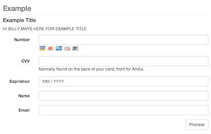

# collect
Tiny PHP script to easily collect payments through Stripe.

## Installation
Copy config.example.php to config.php and fill in the values, creating as many collection sections as is necessary.
